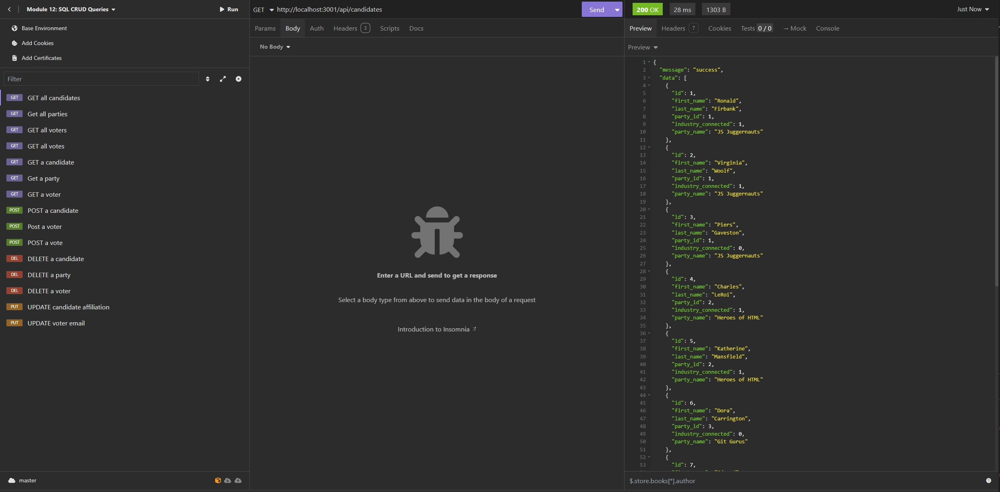

# U-Develop-it

## Description

An election tracking application that uses SQL CRUD (Create, Read, Update & Delete) queries to make changes to a database. User can track votes, candidates and parties for an ongoing election.

## Requirements

For development, you will only need Node.js.

## Installation

### Node installation on Windows

Please visit [Official Node.js Website](https://nodejs.org/) and download the installer.
Also, be sure to have `git` available in your PATH, `npm` might need it (You can find git [here](https://git-scm.com/)).

To install all node modules and dependencies, please run the command. npm install

## Usage

## Technologies Used

- JavaScript
- Node.js
- Express.js
- SQL

## Contributions

- Shane Bramble-Wade

## Project Status

Project is: _completed_

## Contact

Created by [@kranniax](https://twitter.com/kranniax) - feel free to contact me!
